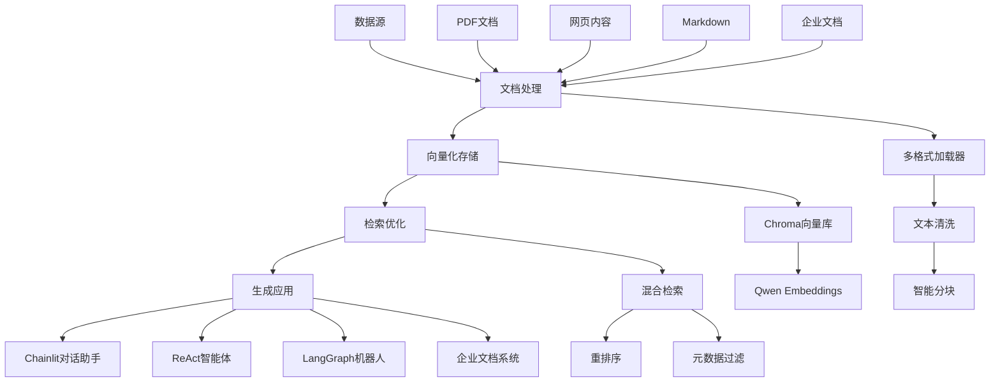

# LangChain 演示项目 🚀

> 一套「从入门到实战」的 LangChain / RAG 中文教程与应用脚本，帮助你在本地快速搭建向量检索、智能对话、企业文档处理等完整 AI 应用。

## 📋 目录

- [项目概述](#项目概述)
- [核心特色](#核心特色)
- [技术架构](#技术架构)
- [快速上手](#快速上手)
- [学习路径](#学习路径)
- [应用实战](#应用实战)
- [企业级功能](#企业级功能)
- [项目结构](#项目结构)
- [环境配置](#环境配置)
- [常见问题](#常见问题)
- [学习建议](#学习建议)

## 🎯 项目概述

`langchain-demos` 是一个完整的 LangChain 学习与实践项目，包含：

- **5 个渐进式 Jupyter 笔记本**：从 LangChain 基础到 RAG 系统构建
- **3 个实战应用脚本**：Chainlit 对话助手、ReAct 智能体、LangGraph 对话机器人
- **1 个企业级文档处理方案**：多格式文档统一处理流水线

适合人群：
- 🌱 **初学者**：系统学习 LangChain 生态和 RAG 技术栈
- 🛠️ **开发者**：获取可直接落地的代码模板和最佳实践
- 🏢 **企业用户**：快速搭建内部知识库和文档处理系统

## ✨ 核心特色

1. **渐进式学习路径** - 从基础概念到复杂应用，循序渐进
2. **多模型支持** - 兼容 DeepSeek、Qwen、OpenAI 等主流模型
3. **持久化向量库** - 使用 Chroma + Qwen Embeddings，支持本地存储
4. **完整应用场景** - 涵盖文档问答、智能搜索、对话机器人等
5. **企业级处理** - 多格式文档统一处理，支持 PDF、Markdown、网页等
6. **现代化工具链** - 基于 uv 包管理，Python 3.12 环境

## 🏗️ 技术架构



## 🚀 快速上手

### 1. 环境准备

```bash
# 安装 uv 包管理器
curl -LsSf https://astral.sh/uv/install.sh | sh

# 确认 Python 3.12
uv python list
uv python install 3.12  # 如需要

# 复制环境变量配置
cp .env-example .env
# 编辑 .env 文件，填入必要的 API 密钥
```

### 2. 安装依赖

```bash
# 一键安装所有依赖
uv sync
```

### 3. 启动学习环境

```bash
# 启动 Jupyter Lab（推荐用于学习笔记本）
uv run jupyter lab
```

浏览器会自动打开 Jupyter Lab，按顺序运行 `01` → `05` 笔记本。

### 4. 运行应用示例

```bash
# Chainlit PDF 问答助手
uv run chainlit run 06_chainlit.py --host 0.0.0.0 --port 8000

# ReAct 智能体
uv run python 07_react.py

# LangGraph 对话机器人
uv run python 08_langgraph.py
```

## 📚 学习路径

### 基础入门（01-02）

| 笔记本 | 主题 | 学习目标 | 关键技术 |
|--------|------|----------|----------|
| `01_langchain_basics.ipynb` | LangChain 基础 | 理解核心概念 | 模型封装、提示词模板、链式调用 |
| `02_document_loading_and_splitting.ipynb` | 文档处理 | 掌握数据摄取 | PDF/网页加载、文本分割、元数据管理 |

### 核心技术（03-04）

| 笔记本 | 主题 | 学习目标 | 关键技术 |
|--------|------|----------|----------|
| `03_vectorization_and_retrieval.ipynb` | 向量化检索 | 构建向量库 | Qwen Embeddings、Chroma、混合检索 |
| `04_rag_retrieval_optimization.ipynb` | 检索优化 | 提升检索效果 | 重排序、元数据过滤、召回调优 |

### 应用实战（05）

| 笔记本 | 主题 | 学习目标 | 关键技术 |
|--------|------|----------|----------|
| `05_rag_pdf_robot.ipynb` | PDF 问答机器人 | 构建完整应用 | ConversationalRetrievalChain、对话记忆 |

## 🛠️ 应用实战

### 1. Chainlit PDF 问答助手 (`06_chainlit.py`)

**功能特色：**
- 📄 基于 PDF 文档的智能问答
- 💬 支持多轮对话和上下文记忆
- 🔍 自动显示参考来源和引用
- 🎨 现代化 Web 界面

**运行方式：**
```bash
uv run chainlit run 06_chainlit.py --host 0.0.0.0 --port 8000
```

**前置条件：** 需要先运行 Notebook 03 或 05 生成向量库文件。

### 2. ReAct 智能体 (`07_react.py`)

**功能特色：**
- 🌐 集成 Tavily 实时搜索
- 🐍 内置 Python REPL 工具
- 🤔 思考-行动-观察循环
- 🔧 可扩展工具链

**运行方式：**
```bash
uv run python 07_react.py
```

**配置要求：** 需要配置 `TAVILY_API_KEY`。

### 3. LangGraph 对话机器人 (`08_langgraph.py`)

**功能特色：**
- 🔄 基于 LangGraph 的状态管理
- 💭 智能对话流程控制
- 🎯 支持条件分支和循环
- 🛡️ 内置安全退出机制

**运行方式：**
```bash
uv run python 08_langgraph.py
```

## 🏢 企业级功能

### 企业文档处理系统 (`enterprise_doc_processing.ipynb`)

**解决痛点：**
- 📁 文档格式多样：PDF、Word、Markdown、网页
- 🔗 信息分散：技术文档、产品手册、会议记录
- ⚡ 处理效率低：手动整理、格式转换困难

**核心功能：**

#### 1. 多格式统一加载
```python
# 支持的文档格式
supported_formats = {
    '.pdf': PDF文档处理,
    '.md': Markdown文档处理,
    '.html': 网页内容抓取
}
```

#### 2. 智能文本清洗
- 去除多余空白字符
- 过滤特殊符号
- 统一中文标点
- 保留有效内容

#### 3. 语义智能分块
- 基于段落和句子的智能分割
- 可配置块大小和重叠
- 保留完整的语义上下文

**使用流程：**
1. 准备文档：将企业文档放入 `./files/enterprise_docs/` 目录
2. 运行处理：在 Jupyter 中执行 `enterprise_doc_processing.ipynb`
3. 获取结果：处理后的文本块可用于向量化和检索

## 📁 项目结构

```
langchain-demos/
├── 📓 学习笔记本
│   ├── 01_langchain_basics.ipynb          # LangChain 基础概念
│   ├── 02_document_loading_and_splitting.ipynb  # 文档加载与分割
│   ├── 03_vectorization_and_retrieval.ipynb     # 向量化与检索
│   ├── 04_rag_retrieval_optimization.ipynb      # RAG 检索优化
│   ├── 05_rag_pdf_robot.ipynb                  # PDF 问答机器人
│   └── enterprise_doc_processing.ipynb          # 企业文档处理
│
├── 🚀 应用脚本
│   ├── 06_chainlit.py                     # Chainlit 对话助手
│   ├── 07_react.py                        # ReAct 智能体
│   └── 08_langgraph.py                    # LangGraph 对话机器人
│
├── ⚙️ 配置文件
│   ├── .env-example                       # 环境变量模板
│   ├── pyproject.toml                     # 项目依赖配置
│   ├── uv.lock                           # 锁定版本文件
│   └── chainlit.md                       # Chainlit 欢迎页
│
├── 📂 数据目录
│   └── files/                             # 存放文档和向量库
│       ├── pdf_vectordb/                 # PDF 向量库
│       └── enterprise_docs/              # 企业文档目录
│
└── 📖 文档
    └── README.md                          # 项目说明文档
```

## ⚙️ 环境配置

### 必需配置

编辑 `.env` 文件，填入以下信息：

```bash
# OpenAI 兼容 API 配置（支持 DeepSeek、Qwen 等）
OPENAI_API_KEY=your_api_key_here
OPENAI_API_BASE=https://api.deepseek.com/v1

# Tavily 搜索 API（ReAct 智能体需要）
TAVILY_API_KEY=your_tavily_key_here
```

### 可选配置

```bash
# LangSmith 追踪（用于调试和监控）
LANGSMITH_API_KEY=your_langsmith_key
LANGSMITH_TRACING=true
LANGSMITH_PROJECT=langchain-demos
```

### 支持的模型提供商

| 提供商 | 模型示例 | 配置方式 |
|--------|----------|----------|
| DeepSeek | deepseek-ai/DeepSeek-V3 | 使用官方 API |
| Qwen | qwen-plus | 使用阿里云 API |
| OpenAI | gpt-4, gpt-3.5-turbo | 使用官方 API |

## ❓ 常见问题

### 安装与环境问题

**Q: `uv` 命令未找到？**
```bash
# 确保安装路径在 PATH 中
export PATH="$HOME/.local/bin:$PATH"
source ~/.bashrc
```

**Q: Python 版本不兼容？**
```bash
# 安装指定版本
uv python install 3.12
uv python pin 3.12
```

### 运行时问题

**Q: Chainlit 找不到向量库？**
- 确保已运行 Notebook 03 或 05
- 检查 `./files/pdf_vectordb/` 目录是否存在
- 验证 Chroma 数据库文件完整性

**Q: LLM 调用失败（401/429 错误）？**
- 检查 `.env` 中的 API 密钥是否正确
- 确认账户余额和调用限制
- 尝试更换模型或调整请求频率

**Q: Tavily 搜索不工作？**
- 确认 `TAVILY_API_KEY` 已正确配置
- 检查网络连接和防火墙设置
- 验证 Tavily 服务可用性

### 性能优化

**Q: 向量检索速度慢？**
- 调整 `chunk_size` 和 `chunk_overlap` 参数
- 考虑使用更小的嵌入模型
- 优化元数据过滤条件

**Q: 内存占用过高？**
- 减少 `chunk_size` 参数
- 使用流式处理大文档
- 定期清理临时文件

## 💡 学习建议

### 初学者路径

1. **理论学习**：先完成 `01` 笔记本，理解 LangChain 核心概念
2. **实践操作**：按顺序执行 `02` → `03` → `04`，掌握每个技术环节
3. **综合应用**：运行 `05` 笔记本，构建完整的 PDF 问答系统
4. **界面体验**：启动 `06_chainlit.py`，感受 Web 应用的用户体验

### 进阶开发者路径

1. **智能体探索**：研究 `07_react.py`，理解 ReAct 模式和工具链
2. **图编程学习**：分析 `08_langgraph.py`，掌握状态图编程
3. **企业应用**：深入学习 `enterprise_doc_processing.ipynb`
4. **定制开发**：基于现有模板，开发自己的 AI 应用

### 最佳实践

1. **版本控制**：定期提交代码变更，保持项目整洁
2. **环境隔离**：使用 `uv` 管理依赖，避免版本冲突
3. **配置管理**：敏感信息使用 `.env` 文件，不要提交到版本库
4. **文档更新**：及时更新 README 和代码注释
5. **测试验证**：每次修改后进行完整测试

## 🤝 贡献指南

欢迎提交 Issue 和 Pull Request 来改进项目！

### 开发环境设置

```bash
# 克隆项目
git clone <repository-url>
cd langchain-demos

# 安装开发依赖
uv sync --dev

# 运行测试
uv run pytest
```

## 📄 许可证

本项目采用 MIT 许可证，详见 LICENSE 文件。

---

## 🎉 开始你的 AI 之旅

现在就启动学习环境，开始探索 LangChain 的无限可能吧！

```bash
# 一键启动
uv run jupyter lab
```

如果你在使用过程中遇到任何问题，欢迎查看 [常见问题](#常见问题) 部分或提交 Issue。

祝学习愉快，开发顺利！🚀